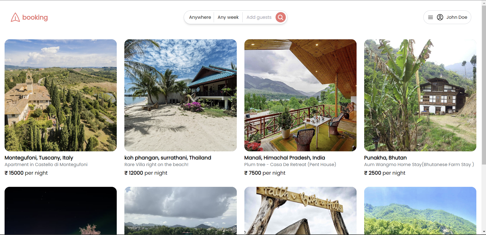
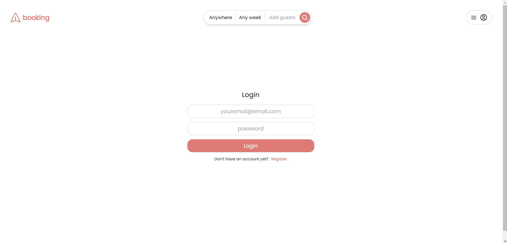
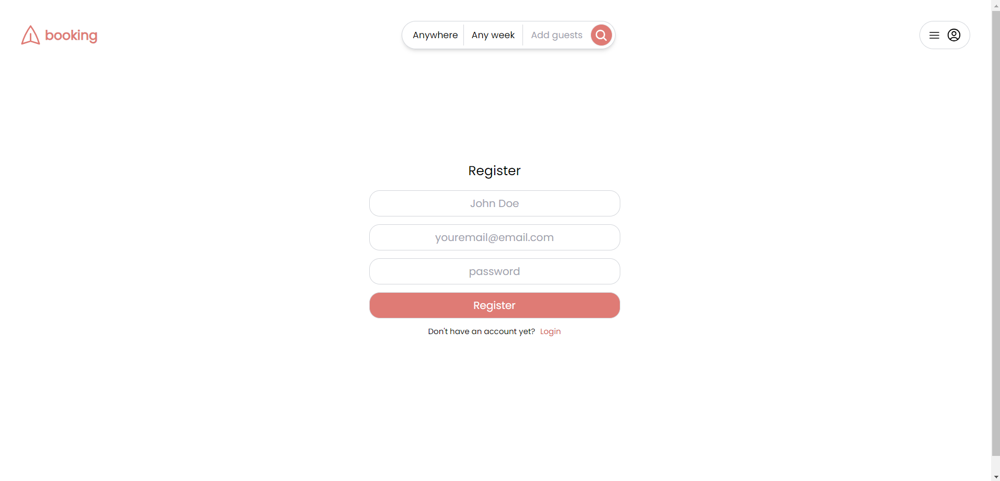
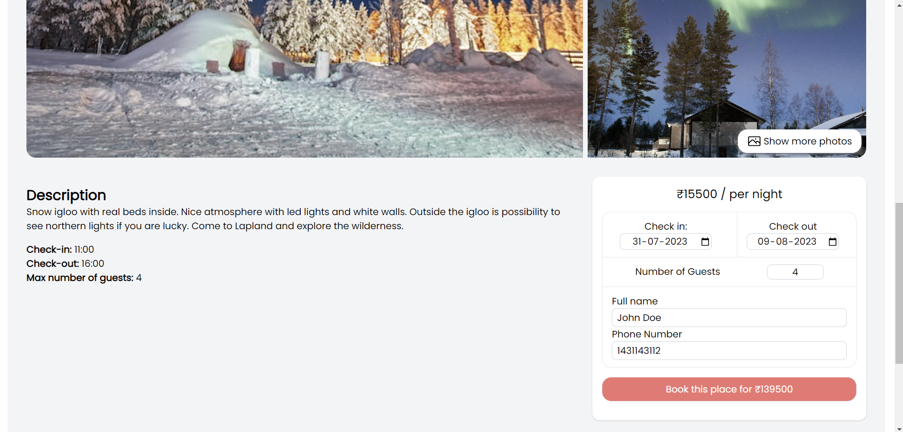
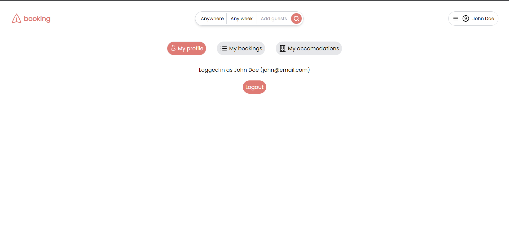
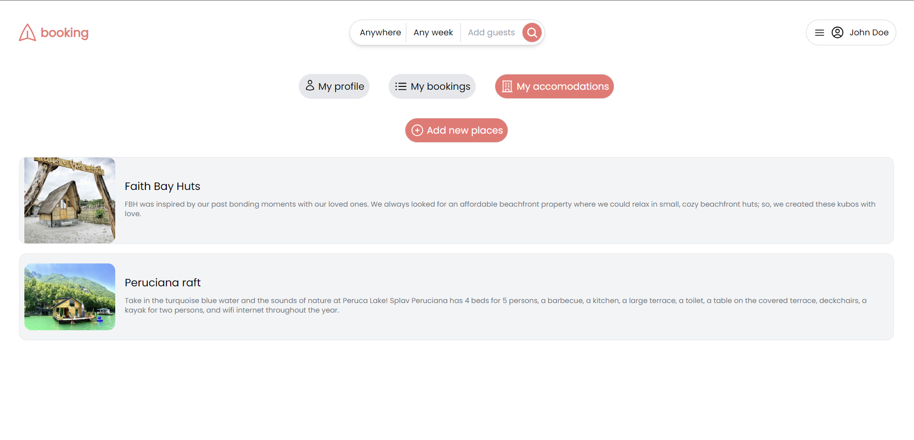
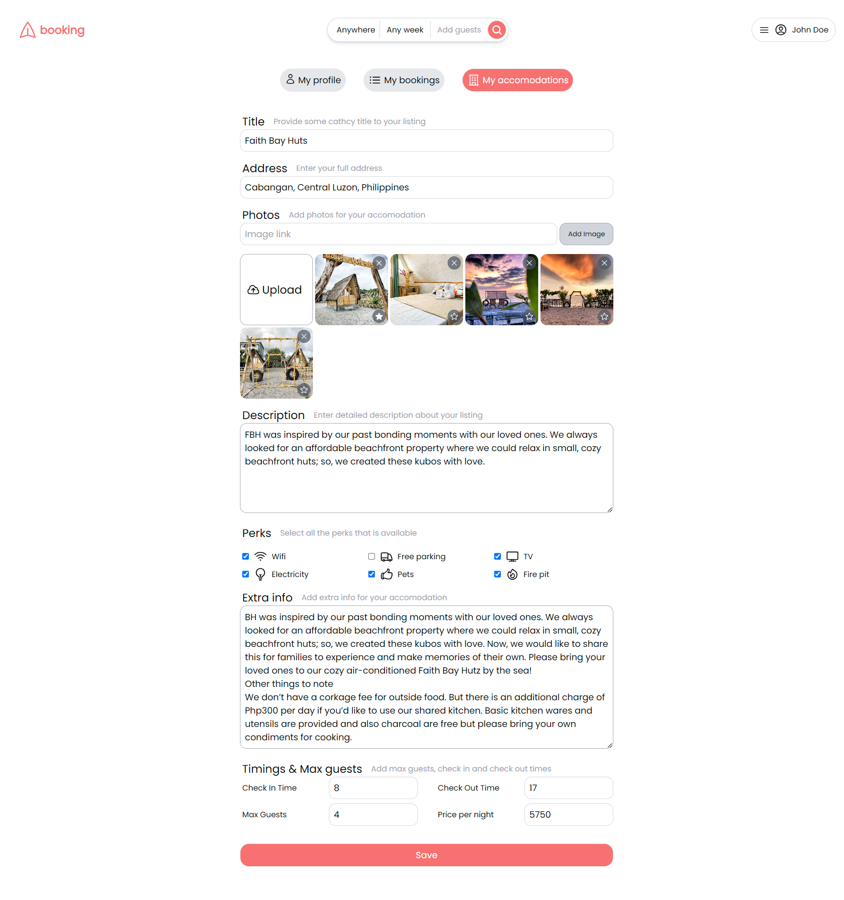
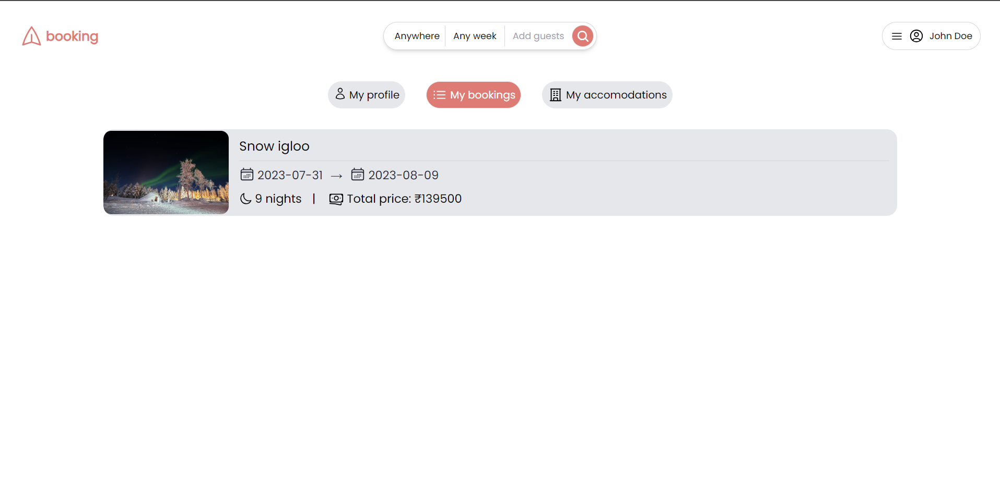
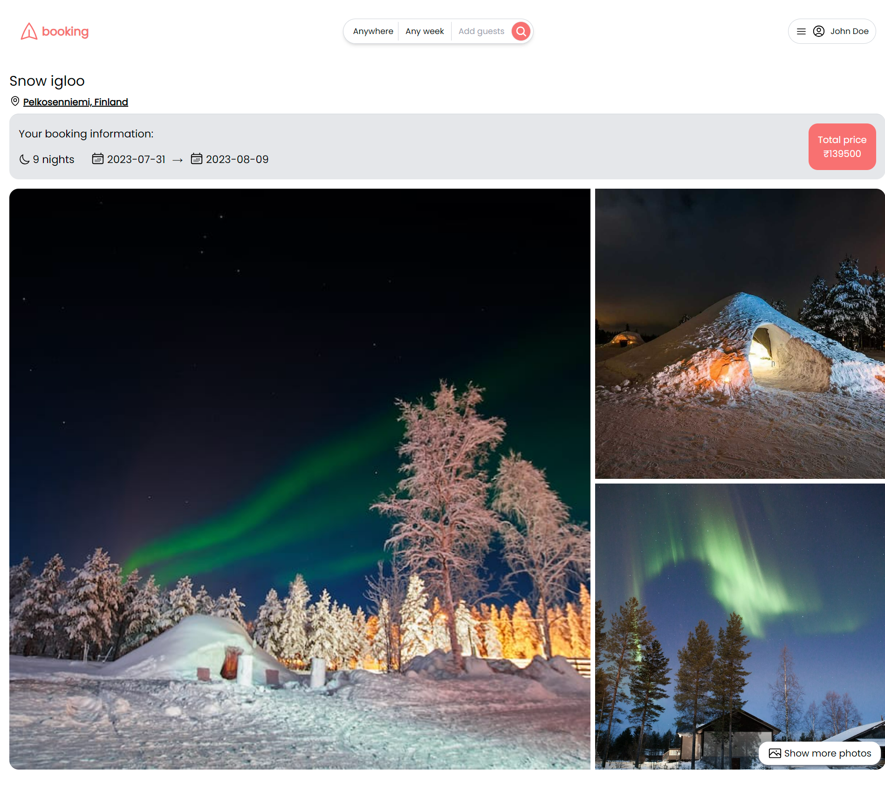

# Booking App (Airbnb clone)
This project is about a booking app whose design is similar to the famous hotel booking platform airbnb. User can login/register to this website, create their own listing, view listing from other users. User can also book any accomodation and can view the booked accomodations.

### Features of this app
- Login, Logout and register functionality with jsonwebtoken authentication.
- Detailed view of all accomodation with images stored in mongo DB.
- User can list their own accomodation after logging in to the app.
- User can Add image links or upload images from device for thier accomodation, feature added with the help of multer middleware.
- User can edit their listing and can update or remove images.
- User can select a preferred picture to display as a cover image.
- User can book any accomodation.
- User can view all their bookings.

### Preview

**Homepage**

**Login Page**

**Register Page**

**Accomodation details / Book accomodation**

**Profile Browse**

**Accomodation Listed by User**

**Add / Edit accomodation**

**Booked accomodation**

**Booked accomodation details**

### Developed with

*Frontend*
- React
- react-dom
- react-router-dom
- axios
- date-fns
- tailwind css

*Backend*
- Mongo DB
- Express
- bcrypt
- cookie parser
- cors
- image-downloader
- jsonwebtoken
- mongoose
- multer